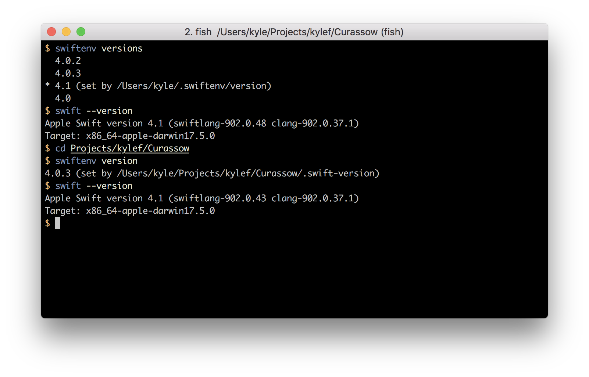

# Swift Version Manager

swiftenv allows you to easily install, and switch between multiple versions of Swift.

This project was heavily inspired by [pyenv](https://github.com/yyuu/pyenv).

swiftenv allows you to:

- Change the **global Swift version**, per user.
- Set a **per-project Swift version**.
- Allows you to **override the Swift version** with an environmental variable.

## The User Guide

- [Installation](https://swiftenv.fuller.li/en/latest/installation.html)
- [Getting Started](https://swiftenv.fuller.li/en/latest/getting-started.html)
- [Command Reference](https://swiftenv.fuller.li/en/latest/commands.html)
    - [`version`](https://swiftenv.fuller.li/en/latest/commands.html#version)
    - [`versions`](https://swiftenv.fuller.li/en/latest/commands.html#versions)
    - [`global`](https://swiftenv.fuller.li/en/latest/commands.html#global)
    - [`local`](https://swiftenv.fuller.li/en/latest/commands.html#local)
    - [`install`](https://swiftenv.fuller.li/en/latest/commands.html#install)
    - [`uninstall`](https://swiftenv.fuller.li/en/latest/commands.html#uninstall)
    - [`which`](https://swiftenv.fuller.li/en/latest/commands.html#which)
- Integrations
    - [Heroku](https://swiftenv.fuller.li/en/latest/integrations/heroku.html)
    - [Travis CI](https://swiftenv.fuller.li/en/latest/integrations/travis-ci.html)
    - [GitLab CI](https://swiftenv.fuller.li/en/latest/integrations/gitlab-ci.html)
    - [CircleCI](https://swiftenv.fuller.li/en/latest/integrations/circle-ci.html)
    - [Docker](https://swiftenv.fuller.li/en/latest/integrations/docker.html)
